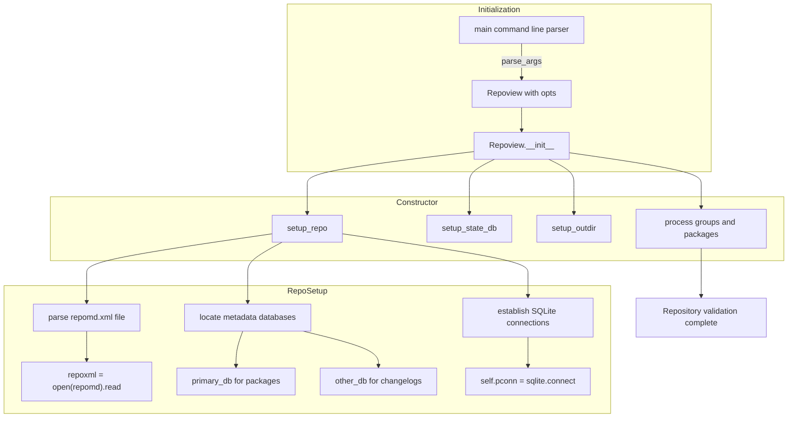
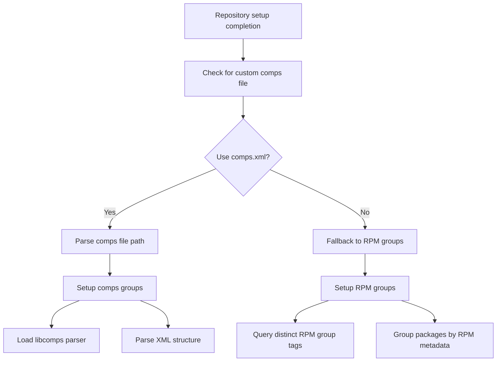
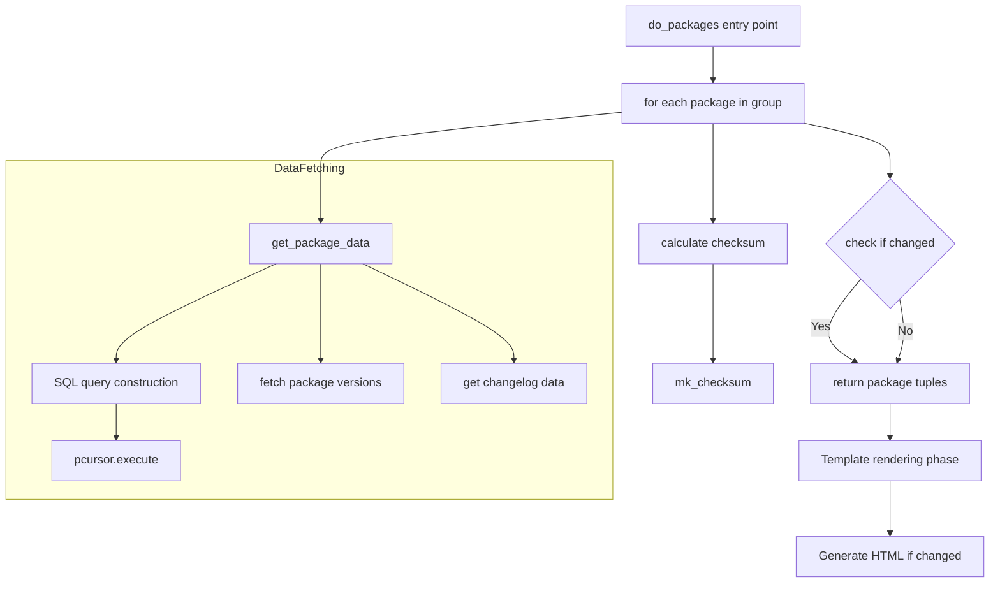
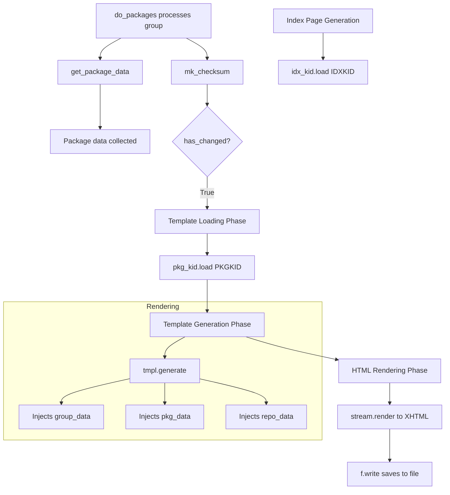
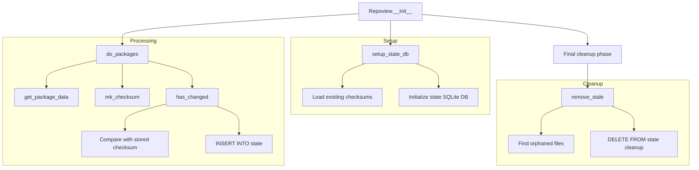

# Repoview Data Processing and Generation Flow

This codemap traces the complete data processing pipeline of Repoview, from repository metadata parsing through static HTML generation. Key locations include the main entry point, repository validation, package data querying, template rendering, and state management.

## Trace 1: Repository Initialization and Setup
**Description**: Entry point flow from command line to repository validation and database connections

### Key Locations
| ID | Title | Description | Source | Code |
|---|---|---|---|---|
| 1a | Main Entry Point | Instantiates the Repoview controller with parsed command line options | repoview.py:1048 | `Repoview(opts)` instantiates the controller |
| 1b | Repository Setup | Validates repository structure and locates metadata files | repoview.py:196 | `self.setup_repo()` kicks off repository validation |
| 1c | Metadata Parsing | Reads and parses repomd.xml to find database locations | repoview.py:379 | `repoxml = open(repomd).read()` loads metadata XML |
| 1d | Database Connections | Establishes SQLite connections to primary and other metadata databases | repoview.py:420 | `self.pconn = sqlite.connect(primary)` opens primary DB |

## Trace 2: Group Discovery and Organization
**Description**: How packages are organized into groups using comps.xml or RPM group tags

### Key Locations
| ID | Title | Description | Source | Code |
|---|---|---|---|---|
| 2a | Comps File Check | Determines whether to use custom comps.xml or repository default | repoview.py:428 | `if self.opts.comps:` honors CLI override |
| 2b | Comps Groups Setup | Parses comps.xml to extract package group definitions | repoview.py:432 | `self.setup_comps_groups(comps)` loads comps data |
| 2c | XML Parsing | Uses libcomps to parse the comps.xml file structure | repoview.py:794 | `comps.fromxml_f(compsxml)` parses comps XML |
| 2d | RPM Groups Fallback | Uses RPM group tags when comps.xml is not available | repoview.py:203 | `self.setup_rpm_groups()` builds fallback groups |

## Trace 3: Package Data Processing and Generation
**Description**: Core data flow from package querying to individual HTML page generation

### Key Locations
| ID | Title | Description | Source | Code |
|---|---|---|---|---|
| 3a | Package Processing Init | Starts processing packages for each group | repoview.py:239 | `packages = self.do_packages(...)` drives group build |
| 3b | Package Data Query | Queries SQLite databases for package metadata and changelogs | repoview.py:641 | `pkg_data = self.get_package_data(pkgname)` |
| 3c | Database Query Execution | Executes SQL to fetch package versions and metadata | repoview.py:532 | `pcursor.execute(query)` runs package query |
| 3d | Change Detection | Calculates checksum to determine if regeneration is needed | repoview.py:650 | `checksum = self.mk_checksum(...)` |

## Trace 4: Template Rendering and HTML Generation
**Description**: How Genshi templates are processed to generate the final HTML output

### Key Locations
| ID | Title | Description | Source | Code |
|---|---|---|---|---|
| 4a | Template Loading | Loads the package template using Genshi TemplateLoader | repoview.py:658 | `tmpl = self.pkg_kid.load(PKGKID)` fetches template |
| 4b | Template Generation | Generates template stream with package and repository data | repoview.py:660 | `stream = tmpl.generate(...)` |
| 4c | HTML Rendering | Renders the template to XHTML and writes to file | repoview.py:666 | `handle.write(stream.render(...))` writes XHTML |
| 4d | Index Generation | Generates the main index page with group listings | repoview.py:278 | `tmpl = idx_kid.load(IDXKID)` prepares index template |

## Trace 5: State Management and Incremental Builds
**Description**: Efficiency mechanisms for tracking changes and avoiding unnecessary regeneration

### Key Locations
| ID | Title | Description | Source | Code |
|---|---|---|---|---|
| 5a | State Database Setup | Initializes SQLite database for tracking file checksums | repoview.py:199 | `self.setup_state_db()` prepares state tracking |
| 5b | Change Detection | Checks if file content has changed since last generation | repoview.py:651 | `if self.has_changed(...):` guards writes |
| 5c | State Tracking | Records new file checksums in the state database | repoview.py:716 | `INSERT INTO state (filename, checksum)` |
| 5d | Cleanup Process | Removes files that are no longer present in the repository | repoview.py:295 | `self.remove_stale()` prunes files |
